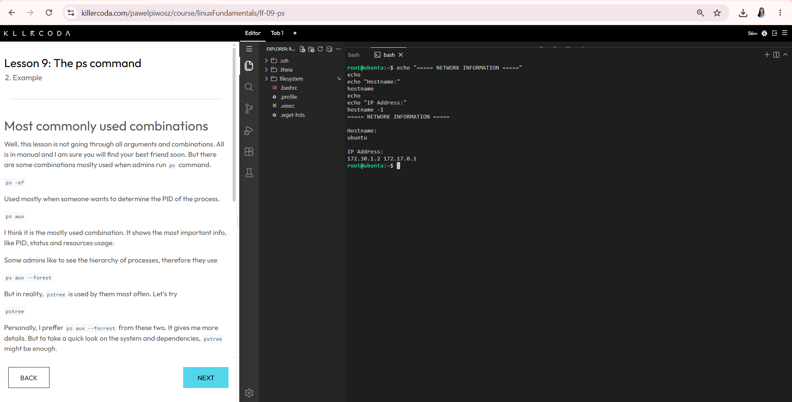
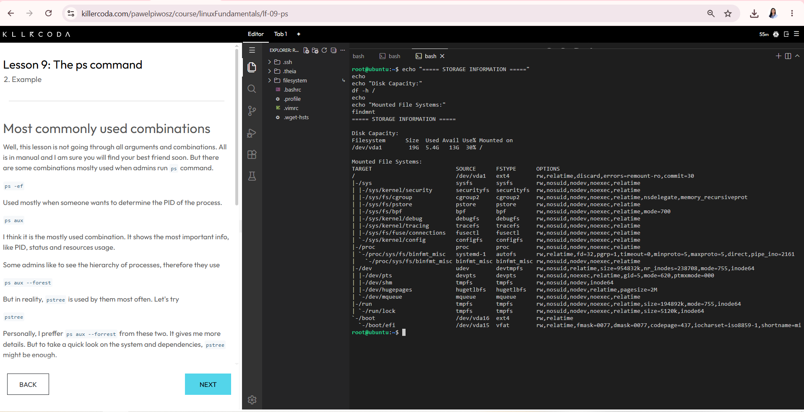
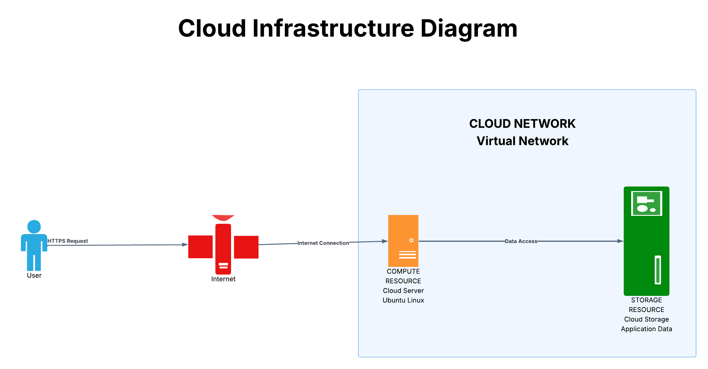

<h1 align="center">Laboratory 02</h1>

<h2 align="center">Build the Cloud Infrastructure Blueprint</h2>

<p align="center">
Cloud Infrastructure Assessment Report
</p>

---

## Mission Overview

This laboratory focused on investigating a Linux server provided through the KillerCoda cloud environment. The activity involved checking the server's operating system, CPU, memory, storage, mounted file systems, hostname, and IP address.

The investigation was also used to understand the basic infrastructure components of a cloud environment. In addition, the laboratory included comparing major cloud providers and creating a simple cloud infrastructure diagram for a fictional company.

---

## Objectives

The objectives of this laboratory were to:

- Investigate a Linux server running in a cloud environment.
- Identify the operating system and kernel version.
- Determine the available CPU and RAM resources.
- Check the disk capacity and mounted file systems.
- Identify the hostname and IP address of the server.
- Understand the main components of cloud infrastructure.
- Compare equivalent services offered by AWS, Microsoft Azure, and Google Cloud Platform.
- Create a simple cloud infrastructure diagram.
- Practice technical documentation using Markdown and GitHub.

---

## Cloud Infrastructure Components

| Component | Example in the KillerCoda Environment | Purpose |
|---|---|---|
| **Compute Resource** | Intel Xeon CPU with 1 CPU core | Provides processing power for running applications and services. |
| **Storage Resource** | 19 GB main disk (`/dev/vda1`) | Provides space for the operating system, applications, and files. |
| **Network** | IP address `172.30.1.2` | Allows the server to communicate with other systems and networks. |
| **Operating System** | Ubuntu 24.04.4 LTS | Manages system resources and provides the environment where applications can run. |

---

## Tools Used

The following tools were used during the laboratory:

- **KillerCoda** – Used to access the temporary cloud-based Linux server.
- **Ubuntu Linux** – Operating system investigated during the activity.
- **Linux Terminal** – Used to collect system and network information.
- **GitHub** – Used to store the laboratory files and documentation.
- **Lucidchart** – Used to create the cloud infrastructure diagram.
- **Markdown** – Used to organize the technical documentation.

---

## Linux Commands Executed

The following Linux commands were used to investigate the server.

| Command | Purpose |
|---|---|
| `cat /etc/os-release` | Displays information about the operating system. |
| `uname -r` | Displays the current Linux kernel version. |
| `lscpu` | Displays CPU and processor information. |
| `nproc` | Shows the number of available CPU cores. |
| `free -h` | Displays RAM and memory information in a readable format. |
| `df -h /` | Displays the disk capacity and usage of the main filesystem. |
| `findmnt` | Lists the mounted file systems. |
| `hostname` | Displays the hostname of the server. |
| `hostname -I` | Displays the IP addresses assigned to the server. |

### Investigation Results

The main information collected from the KillerCoda server was:

| Information | Result |
|---|---|
| **Operating System** | Ubuntu 24.04.4 LTS |
| **Kernel Version** | 6.8.0-136-generic |
| **CPU Model** | Intel Xeon E312xx (Sandy Bridge, IBRS update) |
| **CPU Cores** | 1 |
| **Total RAM** | 1.9 GiB |
| **Main Disk** | 19 GB |
| **Hostname** | ubuntu |
| **Main IP Address** | 172.30.1.2 |

---

## Skills Learned

During this laboratory, I learned how to:

- Use basic Linux commands to inspect a server.
- Identify important hardware and system information.
- Check storage and mounted file systems.
- Identify network information from a Linux environment.
- Relate Linux resources to cloud infrastructure concepts.
- Compare infrastructure services between major cloud providers.
- Create a basic cloud infrastructure architecture diagram.
- Organize technical information using Markdown.
- Use GitHub to document and maintain a laboratory project.

---

## Challenges Encountered

One challenge I encountered was understanding the different information displayed by the Linux commands. Some commands produced more details than were required, so I had to identify the specific values needed for the laboratory report.

Another challenge was organizing the collected information into separate documentation files. Creating the cloud infrastructure diagram also required arranging the required components clearly so that the relationship between the user, internet connection, network, compute resource, and storage resource could be easily understood.

---

## Evidence

Screenshots of the Linux investigation are stored in the `screenshots` folder.

### Network Information



### Storage Information



### Cloud Architecture



---

## Repository Structure

```text
Laboratory-02-Build-the-Cloud-Infrastructure-Blueprint/
│
├── README.md
├── infrastructure-report.md
├── cloud-components.md
├── cloud-provider-comparison.md
├── reflection.md
│
└── screenshots/
    ├── network-information.png
    ├── storage-information.png
    └── cloud-architecture.png
