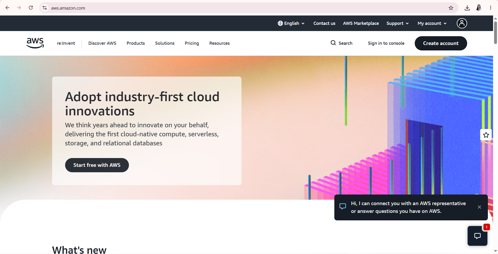

# Amazon Web Services (AWS) Research

## 1. Brief Overview

Amazon Web Services (AWS) is a cloud computing platform provided by Amazon. It offers a wide range of cloud services for computing, storage, databases, networking, security, analytics, and application development.

AWS allows organizations to access computing resources over the internet without having to maintain all of the physical infrastructure themselves.

## 2. Global Infrastructure

AWS operates a global cloud infrastructure organized into geographic Regions and Availability Zones.

An AWS Region is a separate geographic area where AWS operates cloud infrastructure. Each Region contains multiple Availability Zones that are designed to provide isolation and improve application availability and reliability.

AWS also provides infrastructure options such as Local Zones and Wavelength Zones for workloads with specific latency and deployment requirements.

## 3. Cloud Management Console

The AWS Management Console is a web-based interface used to access and manage AWS services.

Users can use the console to:

- Access AWS services
- Create and manage cloud resources
- Select AWS Regions
- Monitor resources
- Manage users and permissions
- View billing information
- Access AWS CloudShell
- Manage applications and services

## 4. Four Core Services

### 1. Amazon EC2

Amazon Elastic Compute Cloud (EC2) provides virtual computing capacity in the AWS Cloud. Organizations can use EC2 to run applications and workloads on virtual servers.

### 2. Amazon S3

Amazon Simple Storage Service (S3) is an object storage service used to store and retrieve data such as files, documents, images, backups, and application data.

### 3. Amazon RDS

Amazon Relational Database Service (RDS) is a managed relational database service that helps organizations set up, operate, and scale databases in the cloud.

### 4. AWS Lambda

AWS Lambda is a serverless computing service that allows developers to run code without directly managing servers.

## 5. Three Advantages

### 1. Scalability

AWS resources can be increased or decreased according to the workload and requirements of an organization.

### 2. Global Infrastructure

AWS provides cloud infrastructure across many geographic locations, allowing organizations to deploy applications in locations suitable for their users and business requirements.

### 3. Wide Range of Services

AWS provides many services covering computing, storage, databases, networking, security, analytics, and application development.

## 6. Typical Enterprise Use Cases

Enterprises commonly use AWS for:

- Web and application hosting
- Data storage and backup
- Database management
- Software development and testing
- Data analytics
- Application migration
- Disaster recovery
- E-commerce applications
- Artificial intelligence and machine learning

## 7. Screenshot

## 8. Official References

- [AWS Official Website](https://aws.amazon.com/)
- [AWS Management Console](https://aws.amazon.com/console/)
- [AWS Global Infrastructure](https://aws.amazon.com/about-aws/global-infrastructure/)
- [AWS Documentation](https://docs.aws.amazon.com/)
